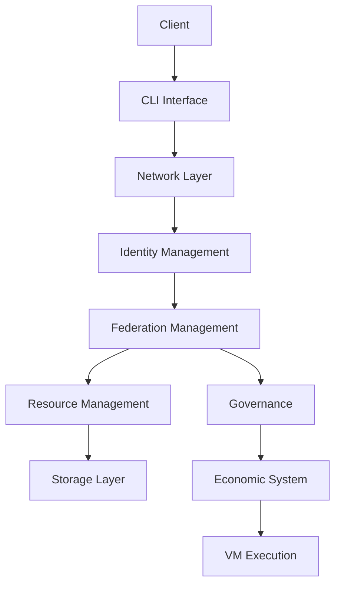

# ICN Architecture Overview

## System Architecture

The Intercooperative Network (ICN) is built with a modular, layered architecture that emphasizes separation of concerns and flexibility. Each major component is implemented as a separate crate, allowing for independent development and testing while maintaining clear interfaces between components.

### Core Components

1. **Core (`icn-core`)**
   - Common types and utilities
   - Error handling
   - Configuration management
   - Logging and metrics

2. **Network (`icn-network`)**
   - P2P communication
   - Protocol implementation
   - Service discovery
   - NAT traversal
   - Connection management

3. **Storage (`icn-storage`)**
   - Distributed storage
   - Data replication
   - Encryption
   - Access control
   - Version control

4. **Governance (`icn-governance`)**
   - Proposal management
   - Voting mechanisms
   - Policy enforcement
   - Decision execution
   - Access control

5. **Economic (`icn-economic`)**
   - Resource pricing
   - Token management
   - Transaction processing
   - Economic policy enforcement

6. **Identity (`icn-identity`)**
   - Identity management
   - Authentication
   - Authorization
   - Credential management

7. **Federation (`icn-federation`)**
   - Federation management
   - Cross-federation communication
   - Policy coordination
   - Resource sharing

8. **Resource (`icn-resource`)**
   - Resource tracking
   - Allocation management
   - Usage monitoring
   - Quota enforcement

9. **DSL (`icn-dsl`)**
   - Domain-specific language
   - Policy definition
   - Smart contract implementation
   - Rule processing

10. **VM (`icn-vm`)**
    - Virtual machine implementation
    - Code execution
    - Sandbox environment
    - Resource isolation

### System Interaction Flow

## Data Flow

1. **Client Requests**
   - Authentication via Identity system
   - Request validation
   - Permission checking

2. **Federation Management**
   - Cross-federation communication
   - Resource coordination
   - Policy enforcement

3. **Resource Allocation**
   - Resource discovery
   - Allocation requests
   - Usage tracking
   - Deallocation

4. **Storage Operations**
   - Data encryption
   - Distribution
   - Replication
   - Access control

5. **Governance**
   - Proposal creation
   - Voting
   - Execution
   - Policy updates

## Security Model

### Authentication & Authorization

- Decentralized identity (DID) based authentication
- Role-based access control
- Federation-level permissions
- Resource-specific access control

### Encryption

- End-to-end encryption for data storage
- Secure communication channels
- Key management
- Federation-specific encryption

### Policy Enforcement

- Governance-controlled policies
- Resource usage limits
- Federation boundaries
- Economic constraints

## Scalability Considerations

1. **Horizontal Scaling**
   - Federation-based scaling
   - Distributed resource management
   - Load balancing

2. **Performance Optimization**
   - Caching strategies
   - Efficient data structures
   - Asynchronous processing

3. **Resource Management**
   - Dynamic resource allocation
   - Load monitoring
   - Automatic scaling

## Future Considerations

1. **Extensibility**
   - Plugin system
   - Custom resource types
   - Protocol extensions

2. **Interoperability**
   - Standard protocols
   - External system integration
   - Cross-chain compatibility

3. **Governance Evolution**
   - Advanced voting mechanisms
   - Automated policy enforcement
   - Dynamic rule updates 